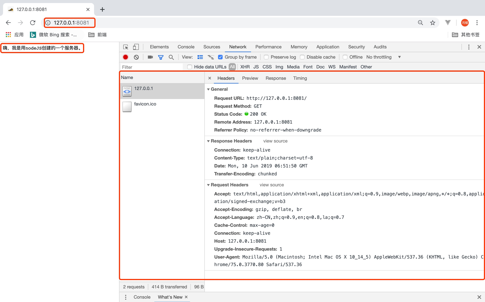
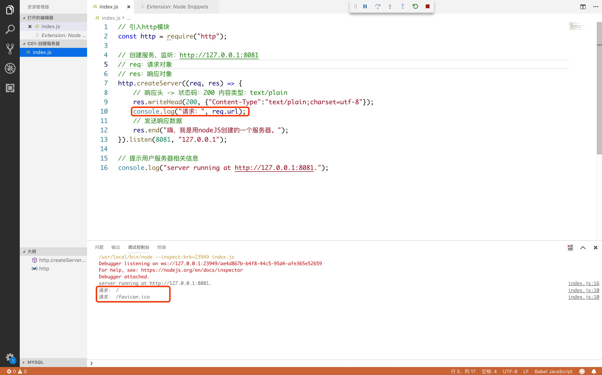
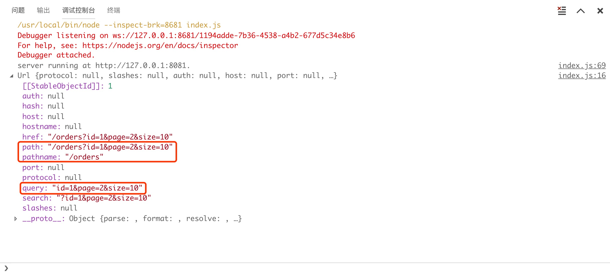
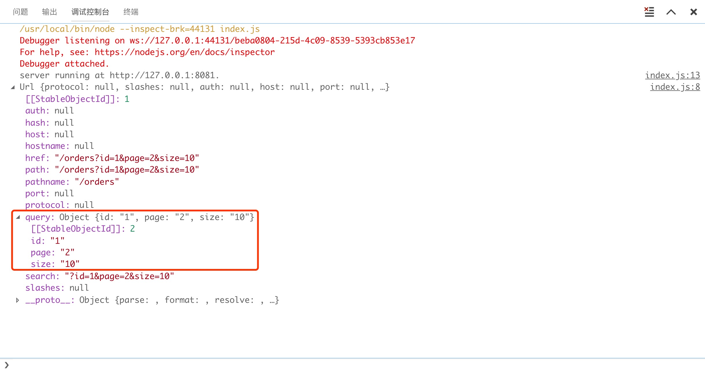
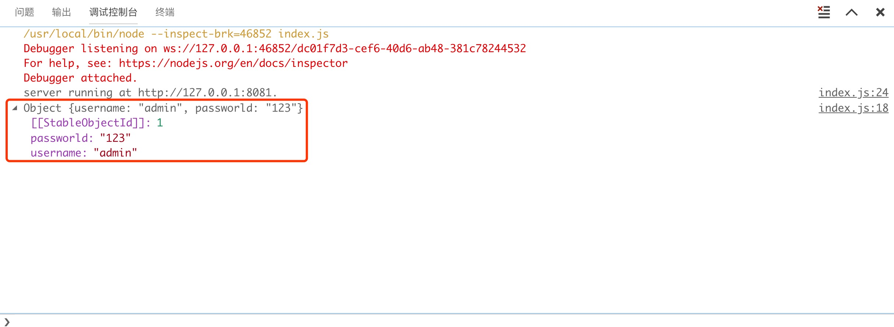

# 一、实现过程

\1. 创建服务器

\2. 路由控制

\3. 跨域处理

\4. Ajax,fetch,axios访问测试

# 二、创建服务器

```js
// 引入http模块
const http = require("http");

// 创建服务，监听：http://127.0.0.1:8081
// req：请求对象
// res：响应对象
http.createServer((req, res) => {
    // 响应头 -> 状态码：200 内容类型：text/plain
    res.writeHead(200, {"Content-Type":"text/plain;charset=utf-8"});
    console.log("请求：", req.url);
    // 发送响应数据
    res.end("嗨，我是用nodeJS创建的一个服务器。");
}).listen(8081, "127.0.0.1"); 

// 提示用户服务器相关信息
console.log("server running at http://127.0.0.1:8081.");
```

> 注意：在header中 *charset=utf-8*  这行代码不能漏掉了。

## 1. 原理

调用http模块的createServer方法就能创建一个服务器对象，这个方法接收一个专门用于处理用户请求的回调函数参数，然后通过返回的对象的listen方法可以监听8081端口。



## 2. 注意事项

初始化时这里是发起了两次请求的，见下边图，红色圈中的地方，也可见下图打印出来的日志， 原因是还发起了一次对图标（favicon.ico）的请求。



## 3. 过滤对图标的请求

```js
if(req.url === "/favicon.ico") return;
```


# 三、通过 node 服务器启动项目

## 1. 概述

实际上只需要引入http，fs 这两个模块就能实现整个功能，http模块用来搭建服务器，fs模块用来读取要打开的文件。

## 2. 代码

```js
// 引入http模块
const http = require("http");
// 引入文件管理模块
const fs   = require("fs");

// 创建服务，监听：http://127.0.0.1:8081
// req：请求对象
// res：响应对象
http.createServer((req, res) => {
    // 响应头 -> 状态码：200 内容类型：text/html
    res.writeHead(200, {"Content-Type":"text/html;charset=utf-8"});
    // 过滤图标请求
    if(req.url === "/favicon.ico") return;
    console.log("请求：", req.url);
    // 读取数据
    fs.readFile("./www/index.html", (err, data) => {
        res.end(data);
    })

}).listen(8081, "127.0.0.1"); 

// 提示用户服务器相关信息
console.log("server running at http://127.0.0.1:8081.");
```

> 注意：读取html文件，应设置内容类型为 "text/html"

上面是一个核心代码的演示，存在较大问题。即：index.html 是写死了的，不管用户发什么请求，node服务器都只会返回index.html文件！

## 3. 完善

上面的代码可以在进一步完善，通过引入url模块来处理地址中的路径，然后来根据前端的路径，响应不同的文件，以解决上面的那个bug。

```js
// 引入http模块
const http = require("http");
// 引入文件管理模块
const fs = require("fs");
// 引入url模块
const url = require("url");

// 创建服务，监听：http://127.0.0   .1:8081
// req：请求对象
// res：响应对象
http.createServer((req, res) => {
    res.writeHead(200, {"Content-Type":"text/html;charset=utf-8"});
    // 过滤图标请求
    if (req.url === "/favicon.ico") return;
    // 获取请求路径名
    let pathname = url.parse(req.url).pathname;
    // 要发送到前端的路径名
    let filename = "";
    if (pathname === "/" || pathname === "") {
        filename = "index.html";
    } else {
        // 去掉第一个‘/’，然后通过他们去寻找对应的路径
        filename = pathname.slice(1);
    }
    console.log(filename);
    // 读取文件返回到前端，因为静态资源放置在www目录下，所以拼接了一个www
    fs.readFile("./www/" + filename, (err, data) => {
        if(err) {
            res.end("打开" + filename + "失败！");
            return;
        }else {
            res.end(data);
        }
    })

}).listen(8081, "127.0.0.1");

// 提示用户服务器相关信息
console.log("server running at http://127.0.0.1:8081.");

```

## 4. 扩展

在这里我们还可使用path模块的extname方法根据文件的后缀来在响应头中添加相应内容，当然，并不是一定要这样做的。

```js
// 引入http模块
const http = require("http");
// 引入文件管理模块
const fs = require("fs");
// 引入url模块
const url = require("url");
// 引入path模块
const path = require("path");

// 创建服务，监听：http://127.0.0   .1:8081
// req：请求对象
// res：响应对象
http.createServer((req, res) => {
    // 获取请求路径名，__dirname 获取项目根路径
    let pathname = __dirname + "/www" + url.parse(req.url).pathname;
    if (pathname.charAt(pathname.length - 1) == "/") {
        // 如果请求路径的最后一个字符是/,那么认为是根目录
        pathname += "index.html"
    }
    fs.exists(pathname, (exists) => {
        // 如果更目录下存在index.html这个文件，那么就设置相应的http响应头部内容
        if (exists) {
            switch (path.extname(pathname)) {
                case ".html":
                    res.writeHead(200, { "Content-Type": "text/html;charset=utf-8" });
                    break;
                case ".js":
                    res.writeHead(200, { "Content-Type": "text/javascript;charset=utf-8" });
                    break;
                case ".css":
                    res.writeHead(200, { "Content-Type": "text/css;charset=utf-8" });
                    break;
                case ".gif":
                    res.writeHead(200, { "Content-Type": "image/gif;charset=utf-8" });
                    break;
                case ".jpg":
                    res.writeHead(200, { "Content-Type": "image/jpg;charset=utf-8" });
                    break;
                case ".png":
                    res.writeHead(200, { "Content-Type": "image/png;charset=utf-8" });
                    break;
                case ".jpeg":
                    res.writeHead(200, { "Content-Type": "image/jpeg;charset=utf-8" });
                    break;
                default:
                    res.writeHead(200, { "Content-Type": "application/octet-stream;charset=utf-8" });
            }
            // 读取文件返回至前端
            fs.readFile(pathname, (err, data) => {
                console.log(new Date().toLocaleString() + ":" + pathname);
                res.end(data);
            })
        } else {
            // 找不到目录时的处理
            res.writeHead(404, { "Content-Type": "text/html;charset=utf-8" });
            res.end("<h1>404 Not Found</h1>");
        }

    });


}).listen(8081, "127.0.0.1");

// 提示用户服务器相关信息
console.log("server running at http://127.0.0.1:8081.");

```

# 四、处理跨域问题

跨域就是允许来自非同源网站的请求访问本站点。对于node, 在 *http.createServer* 方法的参数函数里面写下一句跨域代码就好：

```js
// 允许任意域名源访问
res.setHeader('Access-Control-Allow-Origin', '*');
```

> 注意：跨域代码应该放在最前面

```js
// 允许指定域名源访问 【记住后面不能写 / 】
res.setHeader('Access-Control-Allow-Origin', 'https://www.baidu.com');
```

```js
//允许多域名跨域
let orginList = [
    "http://www.blogzl.com",
    "http://www.hao123.com",
    "https://www.baidu.com"
];
if (orginList.includes(req.headers.origin.toLowerCase())) {
    //设置允许跨域的域名，*代表允许任意域名跨域
    response.setHeader("Access-Control-Allow-Origin", req.headers.origin);
}
```

express跨域：<https://blog.csdn.net/u012149969/article/details/81145144>

# 五、路由控制

## 1. 概述

现在的服务器还无法接收任何参数，不管用户发送什么参数过来，服务器都只会返回 “Hello, nodeJS!”  这句话。如果我们想要在用户发送不同参数与使用不同请求方式后，服务端做出不同的响应，那么我们应该怎么做呢？

## 2. 做法

\1. 先获取用户的请求方式：get/post ?

\2. 再获取用户的请求路径和参数

\3. 根据不同的请求方式与路径和参数做出不同的响应

这就是node中的路由。

## 3. 实现

### 3.1. 获取请求方式

```js
if(req.method === "GET") {
    console.log("请求方法：GET")
}
if(req.method === "POST") {
    console.log("请求方法：POST")
}
```

> 注意：node代码中的GET 与 POST 必须为大写

### 3.2. GET -> 获取路径、参数

由于GET请求直接被嵌入在路径中，URL是完整的请求路径，包括了?后面的部分，因此你可以手动解析后面的内容作为GET请求的参数。nodeJS url 模块中的 parse 函数提供了这个功能。这里需要使用node中的url模块，然后使用此模块对请求中的地址进行处理，获取到我们需要的请求路径和参数值。

```js
const http = require("http");
const url = require("url");
const querystring = require("querystring");

http.createServer((req, res) => {
  	// GET 
    if(req.method == "GET") {
        let obj  = url.parse(req.url);
        console.log(obj);
    }
}).listen(8081, "127.0.0.1");

// 提示用户服务器相关信息
console.log("server running at http://127.0.0.1:8081.");
```

这里假设get请求为：*<http://127.0.0.1:8081/orders?id=1&page=2&size=10>*，服务器输出效果如下：



解读：

- path：请求路径详细值 [路径名+参数] 
- pathname：路径名
- query：参数

这里还可以直接将查询参数转换为一个对象，不过需要引入一个 **querystring ** 模块 。

```js
const http = require("http");
const url = require("url");
const querystring = require("querystring");

http.createServer((req, res) => {
  	// GET 
    if(req.method == "GET") {
        let obj   = url.parse(req.url);
      	// 将query参数转成对象
        let query = querystring.parse(obj.query);
        console.log(query);
    }
}).listen(8081, "127.0.0.1");

// 提示用户服务器相关信息
console.log("server running at http://127.0.0.1:8081.");
```

效果如下：


实际上，我们也可以不通过 querystring 模块来处理，在url的parse方法中，可以传递第二个参数，如果参数设置为true，则会自动将query转成对象。就像下面这样：

```js
url.parse(req.url, true)
```



### 3.3. POST -> 获取路径、参数

POST 请求的内容全部的都在请求体中，http.ServerRequest 并没有一个属性内容为请求体，原因是等待请求体传输可能是一件耗时的工作。

比如上传文件，而很多时候我们可能并不需要理会请求体的内容，恶意的POST请求会大大消耗服务器的资源，所以 node.js 默认是不会解析请求体的，当你需要的时候，需要手动来做。

要获取post请求传递过来的数据，我们需要在data事件的监听函数中监听数据的传送,如下所示：

```js
const http = require("http");
const querystring = require("querystring");
const fs = require("fs");

http.createServer((req, res) => {
    res.setHeader('Access-Control-Allow-Origin', '*');
    if(req.method == "POST") {
        // 定义了一个post变量，用于暂存请求体的信息
        let postData = "";
        // data事件监听函数，每当接受到请求体的数据，就累加到postData 变量中
        req.on("data", data => {
            postData += data;
        });
        // 在end事件触发后，开始处理请求
        req.on("end", () => {
            // 将key=value的形式字符串转换为对象{key:value}
            postData = querystring.parse(postData);
            console.log(postData);
        });
    }
}).listen(8081, "127.0.0.1");

// 提示用户服务器相关信息
console.log("server running at http://127.0.0.1:8081.");
```

现在，在客户端发送一个ajax请求：

```js
$.post({
    url: "http://127.0.0.1:8081/login",
    data: {
        username: "admin",
        passworld: "123"
    }
})
```

服务端显示结果如下：



## 4. 路由处理

所谓路由处理，就是根据不同的请求方式、路径、参数作出响应。

定义路由模块，当用户请求到了后端就会进入到路由模块。我们以两个实例来讲解：

- 当用户是POST请求，且路径为 /login 时，返回字符串：您想要登陆
- 当用户是GET请求，路径为 / ，参数为status=completed时，返回字符串：您想要获取已完成订单信息

\ 定义路由模块：

\ *index.js*

```js
const http = require("http");
const querystring = require("querystring");
const url = require("url");
const router = require("./router.js");

http.createServer((req, res) => {
    // 处理跨域
    res.setHeader('Access-Control-Allow-Origin', '*');
    // 响应header
    res.writeHead(200, {"Content-Type":"text/plain;charset=utf-8"});
    // 过滤空请求
    if(req.url === "/favicon.ico") return;
    // 定义三个变量记录方法类型、路径名、参数
    let method   = req.method, // 类型
        pathname = url.parse(req.url).pathname, // 路径名
        query    = ""; // 参数
    if(method === "GET") {
        // 解析参数
        query = url.parse(req.url, true).query;
        // 传入路由模块
        router({req, res}, {method, pathname, query});
    }else if(method == "POST") {
        req.on("data", (data) => {
            query += data;
        });
        req.on("end", () => {
            // 将key=value的形式字符串转换为对象字符串{key:value}形式
            query = querystring.parse(query);
            router({req, res}, {method, pathname, query});
        });
    }else {
        res.end("ERROR: Can't identify your request type.");
    }
}).listen(8081, "127.0.0.1");

// 提示用户服务器相关信息
console.log("server running at http://127.0.0.1:8081.");

```

\ *router.js*

```js
/**
 * 
 * @param {Object} httpObj  含有请求对象与响应对象
 * @param {Object} urlObj   方法类型、路径、参数
 */
const router = (httpObj, urlObj)  => {
    // 解构属性
    let {res, req} = httpObj;
    let {method, pathname, query} = urlObj;
    console.info(urlObj);
    // 路由处理
    // - 当用户是POST请求，且路径为 /login 时，返回字符串：您想要登陆
    if(method === "POST" && pathname == "/login") {
        res.end("您想要登陆");
    }
    // - 当用户是GET请求，路径为 / ，参数为status=completed时，返回字符串：您想要获取已完成订单信息
    else if(method == "GET" && query.status === "completed") {
        res.end("您想要获取已完成订单信息");
    }
}

module.exports = router;
```

## 5. 返回 JSON 对象

返回JSON对象比较简单，直接返回一个字符串对象就可以啦。

\ *router.js*

```js
if(method === "POST" && pathname == "/login") {
    let obj = {
        nikename: "木子李",
        gender: "男",
        address: "四川省成都市高新区雅和南四路216号"
    }
    res.end(JSON.stringify(obj));
}
```

\ 客户端代码

```js
$.post({
    url: "http://127.0.0.1:8081/login",
    data: {
        username: "admin",
        passworld: "123"
    }
})
```

\ 调试界面


# 六、链接数据库

Mysql 数据库教程：<https://github.com/lihongyao/mysql>

数据库安装之后，我们可以在数据库中创建一个数据库”db_test“，然后创建一个学生信息表”stus“，代码如下所示：

```mysql
mysql> CREATE DATABASE db_test;
Query OK, 1 row affected (0.03 sec)

mysql> USE db_test;
Database changed
mysql> CREATE TABLE stus(
    -> id INT PRIMARY KEY NOT NULL AUTO_INCREMENT,
    -> name VARCHAR(65) NOT NULL,
    -> age INT NOT NULL,
    -> origin VARCHAR(65) NOT NULL,
    -> major VARCHAR(65) NOT NULL);
Query OK, 0 rows affected (0.08 sec)

mysql> DESC stus;
+--------+-------------+------+-----+---------+----------------+
| Field  | Type        | Null | Key | Default | Extra          |
+--------+-------------+------+-----+---------+----------------+
| id     | int(11)     | NO   | PRI | NULL    | auto_increment |
| name   | varchar(65) | NO   |     | NULL    |                |
| age    | int(11)     | NO   |     | NULL    |                |
| origin | varchar(65) | NO   |     | NULL    |                |
| major  | varchar(65) | NO   |     | NULL    |                |
+--------+-------------+------+-----+---------+----------------+
5 rows in set (0.01 sec)
```

## 1. 流程

stips 1：安装mysql模块

```shell
$ npm install mysql
```

stips 2：在文件中导入mysql模块

```js
const mysql = require("mysql");
```

stips 3：使用mysql对象的createConnection方法连接数据库

```js
var mysql = require('mysql');
var connection = mysql.createConnection({
    // 主机名
    host: '127.0.0.1',
    // 端口
    port: '3306',
    // 用户名
    user: 'root',
    // 密码
    password: 'lihy_930716',
    // 数据库名
    database: 'test_db'
});

// 链接数据库
connection.connect();
...
// 断开链接
connection.end();
```

参数说明：

| 参数               | 描述                                                         |
| ------------------ | :----------------------------------------------------------- |
| host               | 主机地址 （默认：localhost）                                 |
| user               | 用户名                                                       |
| password           | 密码                                                         |
| port               | 端口号 （默认：3306）                                        |
| database           | 数据库名                                                     |
| charset            | 连接字符集（默认：'UTF8_GENERAL_CI'，注意字符集的字母都要大写） |
| localAddress       | 此IP用于TCP连接（可选）                                      |
| socketPath         | 连接到unix域路径，当使用 host 和 port 时会被忽略             |
| timezone           | 时区（默认：'local'）                                        |
| connectTimeout     | 连接超时（默认：不限制；单位：毫秒）                         |
| stringifyObjects   | 是否序列化对象                                               |
| typeCast           | 是否将列值转化为本地JavaScript类型值 （默认：true）          |
| queryFormat        | 自定义query语句格式化方法                                    |
| supportBigNumbers  | 数据库支持bigint或decimal类型列时，需要设此option为true （默认：false） |
| bigNumberStrings   | supportBigNumbers和bigNumberStrings启用 强制bigint或decimal列以JavaScript字符串类型返回（默认：false） |
| dateStrings        | 强制timestamp,datetime,data类型以字符串类型返回，而不是JavaScript Date类型（默认：false） |
| debug              | 开启调试（默认：false）                                      |
| multipleStatements | 是否许一个query中有多个MySQL语句 （默认：false）             |
| flags              | 用于修改连接标志                                             |
| ssl                | 使用ssl参数（与crypto.createCredenitals参数格式一至）或一个包含ssl配置文件名称的字符串，目前只捆绑Amazon RDS的配置文件 |

## 2. nodeJS 操作数据库

### 2.1. 添加数据


