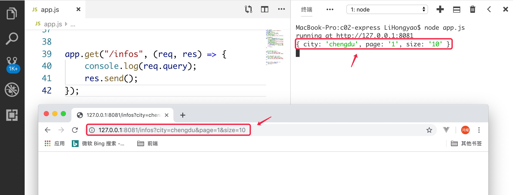

# 一、什么是Express？

基于 [Node.js](https://nodejs.org/en/) 平台，快速、开放、极简的 Web 开发框架。提供了一系列强大特性帮助你创建各种Web 应用，和丰富的 HTTP 工具。使用 Express 可以快速地搭建一个完整功能的网站。

Express 框架核心特性：

- 可以设置中间件来响应HTTP 请求。

- 定义了路由表用于执行不同的HTTP 请求动作。

- 可以通过向模板传递参数来动态渲染HTML 页面。

# 二、安装

通过npm安装：

```shell
$ npm i -S express
```

安装完成后，我们可通过如下指令查看express版本号：

```shell
$ npm list express
└── express@4.17.1 
```

不过一般以下几个重要的模块是需要与express 框架一起安装的：

- `body-parser` ： nodeJS中间件，用于处理 JSON, Raw, Text 和 URL 编码的数据。

- `cookie-parser` ：解析Cookie的工具 。通过req.cookies可以取到传过来的cookie，并把它们转成对象。

- `multer`：nodeJS中间件，用于处理 enctype="multipart/form-data"（设置表单的MIME编码）的表单数据。

```shell
$ npm i -S body-parser cookie-parser multer
```

# 三、基本使用

## 1. 构建服务器

在项目根目录创建app.js文件

```js
// 导入express
const 导入express = require("express");
// 创建express实例
const app= express();
// 监听http://127.0.0.1:8081"
app.listen(8081, "127.0.0.1");
// 打印输出提示信息
console.log("running at http://127.0.0.1:8081");
// 测试
app.get("/", (req, res) => {
  	// 响应，向前端发送数据
    res.send("Hello, exporess!");
});
```

终端执行脚本，运行app.js

```shell
$ node app.js
```

在浏览器输入：“http://127.0.0.1:8081”，可看到页面输出“Hello, exporess!”

## 2. 处理跨域

### 2.1. 允许所有域名跨域

```js
app.all("*", (req, res, next) => {
    //设置允许跨域的域名，*代表允许任意域名跨域
    res.header("Access-Control-Allow-Origin","*");
    //允许的header类型
    res.header("Access-Control-Allow-Headers","content-type");
    //跨域允许的请求方式 
    res.header("Access-Control-Allow-Methods","DELETE,PUT,POST,GET,OPTIONS");
    if (req.method.toLowerCase() == 'options')
        res.send(200);  //让options尝试请求快速结束
    else
        next();
});
```

### 2.2. 允许指定域名跨域

假定允许 “http://127.0.0.1:5500” 访问：

```js
app.all("*", (req, res, next) => {
    //设置允许跨域的域名，*代表允许任意域名跨域
    res.header("Access-Control-Allow-Origin","http://127.0.0.1:5500");
    //允许的header类型
    res.header("Access-Control-Allow-Headers","content-type");
    //跨域允许的请求方式 
    res.header("Access-Control-Allow-Methods","DELETE,PUT,POST,GET,OPTIONS");
    if (req.method.toLowerCase() == 'options')
        res.send(200);  //让options尝试请求快速结束
    else
        next();
});
```

### 2.3. 允许多个域名跨域

```js
app.all("*", (req,res,next) => {
    //定义允许跨域的域名集合
    const origin_list = [
        "http://127.0.0.1:5500",
        "http://127.0.0.1:5501",
        "http://127.0.0.1:5502"
    ];
    if(origin_list.includes(req.headers.origin.toLowerCase())) {
        //设置允许跨域的域名，*代表允许任意域名跨域
        res.header("Access-Control-Allow-Origin", req.headers.origin);
    }
    //允许的header类型
    res.header("Access-Control-Allow-Headers","content-type");
    //跨域允许的请求方式 
    res.header("Access-Control-Allow-Methods","DELETE,PUT,POST,GET,OPTIONS");
    if (req.method.toLowerCase() == 'options')
        res.send(200);  //让options尝试请求快速结束
    else
        next();
});
```

## 3. 获取请求方式与路径

在express中请求方式与请求路径几乎不需要获取，直接写路由即可。如下：app 调用的方法名就是请求方式，第一个参数就是请求路径。

```js
// GET 请求，请求路径为：/
app.get("/", (req, res) => {
    console.log("有人访问[/]接口")
    res.send("You are using a GET request!");
});

// POST 请求，请求路径为：/login
app.post("/login", (req, res) => {
    console.log("有人访问[/login]接口")
    res.send("You are using a POST request!");
});

// 正则匹配，*表示0个或多个字符
app.get("/ab*cd", (req, res) => {
    res.send("正则匹配");
});

// 路由处理也可以是一个数组
app.post(["/usr", "/user"], (req, res) => {
    res.send();
});
```

> 注意：路由方法的第一个参数可以为一个字符串，也可以为一个数组，为字符串时还可以使用正则匹配。

## 4. 获取参数

### 4.1. GET

在express中直接使用请求对象`req`的`query`参数即可获取，而且最终获取的还是已经被转换为对象了的参数，无疑是方便多了（原生还需要我们使用queryString模块来进行显式的转换）。



### 4.2. POST

这里需要使用我们刚才安装的body-parser模块，如下：

 注意三点：

\1. 前端代码需要传递请求头，并且传递参数时应该直接传递一个对象字符串（这和原生node解释参数不一样）

\2. 后端代码需要添加中间件body-parser（**牢记**）

\3. 经过中间件的处理，参数会自动的添加到req请求对象上，作为其一个属性query


前端代码：

```js
fetch("http://127.0.0.1:8081/login", {
    method: "post",
    body: JSON.stringify({
        username: "admin",
        password: "123"
    }),
    headers: {
        "Accept": "application/json",
        "Content-Type": "application/json"
    }
})
.then(res => res.json())
.then(res => {
    console.log(res);
});
```

后端代码：

```js
// 导入中间件 body-parser
const bodyParser = require("body-parser");
// application/x-www-form-urlencoded 解析
app.use(bodyParser.urlencoded({extended:false}));
// application/json 解析
app.use(bodyParser.json());
// 监听post请求
app.post("/login", (req, res) => {
    // 打印参数
    console.log(req.body);
    // 响应数据
    res.send({
        nikename: "木子李",
        tel: "152-2888-5771",
        address: "成都市高新区雅和南四路216号"
    });
});
```

https://www.jianshu.com/p/ea0122ad1ac0


